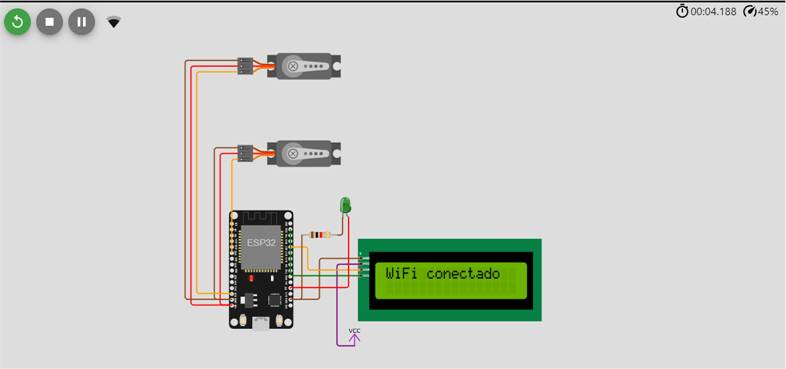
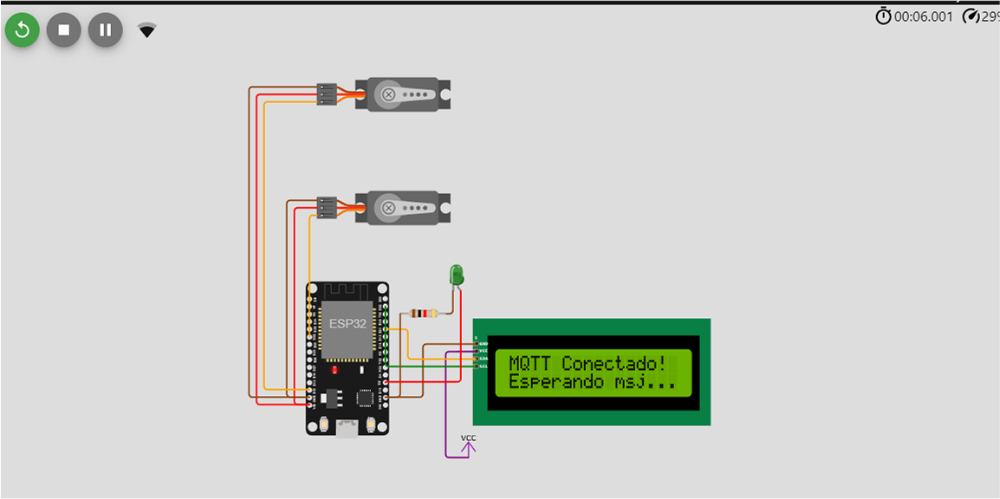
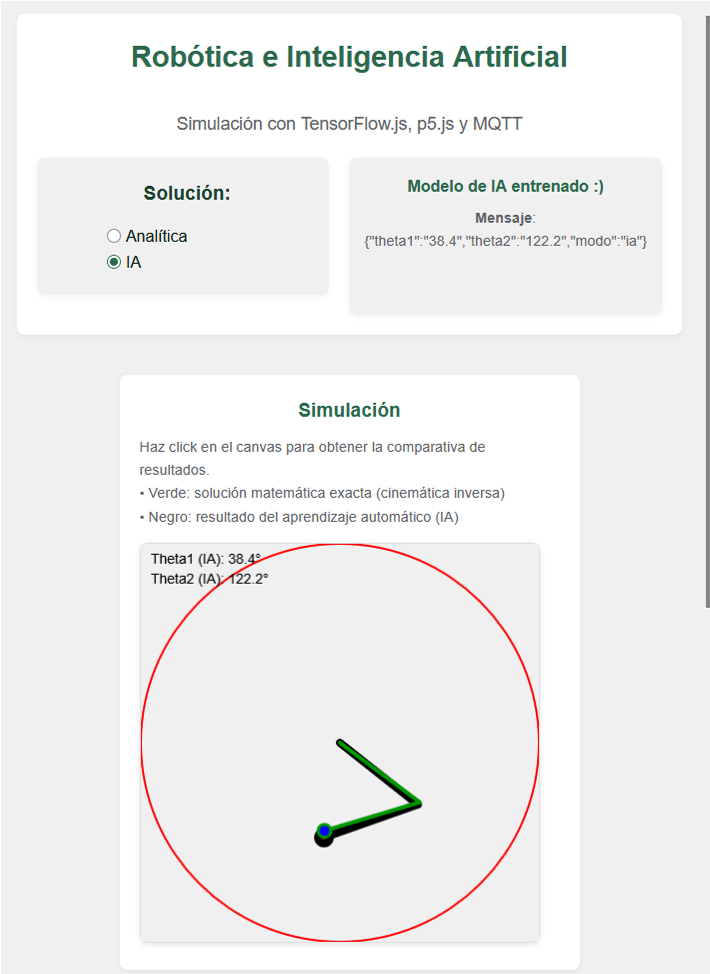
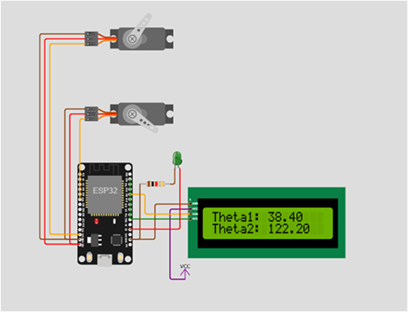

# Sistema de Control Inteligente para Brazo Robótico  [](https://annruiblaz.github.io/AnnaExamen24Abril/)

Sistema híbrido que combina cálculo analítico e IA para controlar un brazo robótico mediante MQTT y ESP32.

## 🌟 Funcionalidades Clave
- **Interfaz Web Interactiva** con simulación en tiempo real
- **Dos Modos de Operación**:
  - 🧮 Solución Analítica (Cinemática Inversa)
  - 🧠 Modelo de IA Entrenado con TensorFlow.js
- **Comunicación en Tiempo Real** mediante MQTT
- **Control Físico** con ESP32 y servomotores SG90
- **Feedback Visual** mediante LCD y LED indicador
- **Limitación de Movimiento** según especificaciones de los servomotores

## 🧩 Componentes del Sistema

### 1. Interfaz Web (Frontend)
**Tecnologías**: HTML5, CSS3, JavaScript, TensorFlow.js, p5.js, MQTT.js

**Funcionamiento**:
```javascript
// Flujo principal de la interfaz web
1. Generar dataset de entrenamiento
2. Entrenar modelo de IA (red neuronal de 2 capas densas)
3. Dibujar simulación con p5.js:
   - Círculo de alcance máximo
   - Brazo analítico (verde) vs IA (negro)
4. Al hacer click:
   - Calcular ángulos según modo seleccionado
   - Publicar mensaje MQTT con estructura JSON:
     {
       "theta1": 45.0,
       "theta2": 90.0,
       "modo": "analitica"
     }
```

### 2. Backend MQTT (Adafruit IO)

- **Broker:** `io.adafruit.com`
- **Protocolo:** MQTT sobre WebSocket
- **Seguridad:** Autenticación por usuario/clave
- **Topic:** `anna_dev/feeds/examenServo`

---

### 3. Controlador ESP32

#### 🧩 Componentes Físicos

- 2x Servomotores SG90 (ejes articulados)
- LCD 16x2 (feedback visual)
- LED verde (indicador modo analítico)
---

#### 🔁 Funcionamiento del Firmware

```cpp
// Flujo principal del ESP32
void loop() {
  // 1. Conectar a WiFi -> MQTT
  // 2. Suscribirse al topic
  // 3. Al recibir mensaje:
  //    a. Parsear JSON con ArduinoJson
  //    b. Mover servomotores a la posición especificada
  //    c. Actualizar LCD con los ángulos
  //    d. Encender LED si el user ha seleccionado el modo analítico
}
```

## 🚀 Instalación y Uso

### Parte Web

```bash
git clone https://github.com/annruiblaz/AnnaExamen24Abril.git
cd AnnaExamen24Abril/web
# Ejecutar la aplicación usando un servidor local (como XAMPP) o VSCode (con el plugin de Live Server)
```

## ⚙️ Configuración del ESP32 (PlatformIO)

```cpp
// Configuración de red y MQTT en espCode.ino
const char *mqttUser = "user_adafruit";
const char *mqttPassword = "password_adafruit";
const char *mqttTopic = "user_adafruit/feeds/topico_a_suscribirse";
```

## 🔄 Flujo de Datos del Sistema

1. Usuario selecciona posición en canvas web
2. Segun la elección del usuario se calcula los ángulos (analítico o IA)
3. Web envia / publica mensaje MQTT con los ángulos
4. ESP32 recibe y procesa el mensaje
5. Los servomotores se posicionan según los ángulos recibidos
6. El LED del ESP32 indica el modo de cálculo usado  
7. En el LCD se muestran los valores actuales

## 📸 Ejemplos de Funcionamiento

#### 1. Conexión del ESP32 a la Red WiFi


#### 2. Conexión del ESP32 al Broker MQTT


#### 3. Envío del Mensaje desde la Interfaz Web


#### 4. Mensaje Recibido en el Broker MQTT


#### 5. Resultado Físico en el ESP32 y Servomotores

